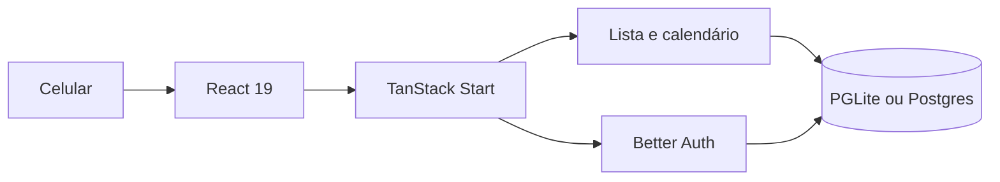

# Tarefas


Lista pessoal do que fazer hoje. O endereço público é [www.tarefas.com.br](https://www.tarefas.com.br).

Você escreve a tarefa, marca o período no calendário e risca o que já fez. Cada conta vê só a própria lista.

## O que dá para fazer

| Tela | O que faz |
| --- | --- |
| Entrar | Conta com e-mail e senha, ou Google |
| Lista | Escrever, buscar, concluir, reordenar e apagar, com desfazer |
| Calendário | Ver o mês e o que está marcado em cada dia |
| Feitas | O que já foi concluído |
| Mais | Perfil, dados, backup, configurações, notificações, privacidade, ajuda, termos e sair |

A abertura mostra a marca e o nome. Na lista, a saudação muda com o horário: bom dia, boa tarde ou boa noite. O tema acompanha claro, escuro ou o sistema.

Apagar some na hora e deixa um aviso só no topo. A seta desfaz todas as tarefas apagadas juntas. Criar, concluir e apagar atualizam a tela antes do servidor confirmar.

## Arquitetura



A interface e as funções de servidor ficam no mesmo app. Sem `DATABASE_URL`, o banco é um PGLite local. Com `DATABASE_URL`, as mesmas consultas vão para o Postgres.

## Stack

- **TypeScript, React 19, Vite e Tailwind CSS 4** — interface escura, verde e pensada para o polegar
- **TanStack Start e TanStack Router** — páginas e navegação
- **Better Auth** — e-mail, senha e Google. A senha do Google não fica no app
- **Zod** — validação do texto que entra na lista
- **Kysely** — consultas
- **PGLite ou Postgres** — tarefas, conta e preferências
- **Lucide** — ícones
- **Sonner** — o aviso de desfazer

O app também é uma PWA: ícone na tela inicial, manifesto e cores da barra do sistema.

## Como rodar

É preciso Node.js 22 ou mais recente e npm.

```bash
npm install
npm run dev
```

Abra [http://localhost:8080](http://localhost:8080).

Crie uma conta com e-mail e senha (mínimo de 8 caracteres). As tarefas ficam no PGLite desta máquina. Para usar Postgres, defina `DATABASE_URL` antes de subir.

```bash
npm run typecheck
npm test
npm run build
```

| Variável | Padrão | Uso |
| --- | --- | --- |
| `DATABASE_URL` | vazio | Postgres. Sem ela, o app usa PGLite |
| `BETTER_AUTH_SECRET` | gerado no preview | Segredo da sessão em produção |
| `BETTER_AUTH_URL` | origem do app | URL pública usada no login |
| `VITE_AUTH_ENABLED` | `true` | Desligue só se a lista for local e sem conta |

## Repositório

O código fica em [github.com/gabrielteramae/tarefas](https://github.com/gabrielteramae/tarefas). O nome do repositório é `tarefas`.

---

© 2026 Gabriel Teramae Chan. Todos os direitos reservados.
